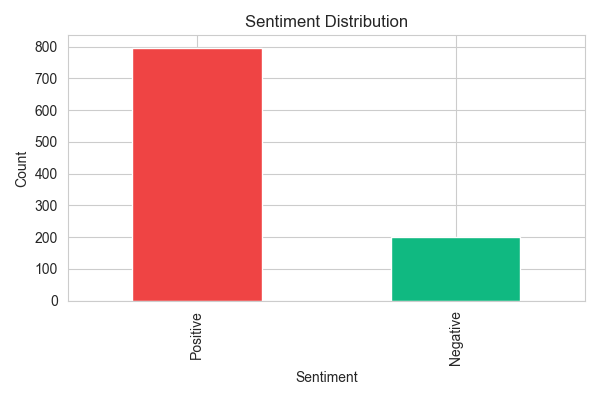
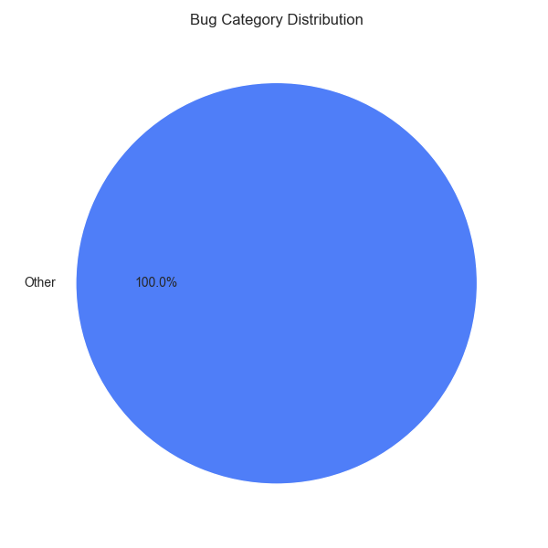

<div align="center">

# 🚀 Product Review Classifier

### AI-Powered Sentiment Analysis & Bug Categorization System

*Automatically analyze customer reviews and convert them into actionable insights — instantly.*

---


</div>

---

## 📌 Overview

**Product Review Classifier** is a Machine Learning (NLP) system that automatically analyzes customer reviews and provides two key outputs:

- **Sentiment Analysis** → Positive / Negative  
- **Bug Classification** → Audio, Login, UI, Other  

👉 In simple words:

Instead of manually reading thousands of reviews, this system reads, understands, and categorizes them in seconds.

> 🔗 **GitHub Repository:** [nawadeakshay/Product-Review-Classifier](https://github.com/nawadeakshay/Product-Review-Classifier)

---

## 🧾 Real-World Example

| Review | Sentiment | Bug |
|--------|-----------|-----|
| "App crashes when I login" | ❌ Negative | Login |
| "Amazing experience!" | ✅ Positive | N/A |
| "Sound not working properly" | ❌ Negative | Audio |
| "UI is confusing" | ❌ Negative | UI |

---

## 🎯 Features

- 🔍 Automatic Sentiment Detection (Positive / Negative)
- 🐞 Bug Categorization (Audio, Login, UI, Other)
- 📊 Excel Report Generation (ready for business use)
- ⚡ High-speed processing (~1000+ reviews/min on GPU)
- 🔁 Batch processing using PyTorch DataLoader
- 🧠 Hybrid system (Deep Learning + Rule-Based logic)
- 📦 Scalable and modular architecture

---

## 🧠 How It Works

### 🔄 Pipeline

```text
Customer Review
        ↓
Text Cleaning (Preprocessing)
        ↓
Tokenization (RoBERTa)
        ↓
Sentiment Model (Deep Learning)
        ↓
Bug Classification (Rule-Based)
        ↓
Excel Output
```

---

## 📊 Visual Insights

### Sentiment Distribution


### Bug Category Distribution


---

## 🏗️ Architecture

### 📦 System Components

```
product_review_classifier/
│
├── data_loader.py        → Data loading & validation
├── preprocessing.py      → Text cleaning & tokenization
├── model.py              → RoBERTa model architecture
├── train.py              → Training pipeline
├── predict.py            → Inference & Excel output
│
├── data/                 → Input datasets
├── models/               → Saved trained models
├── outputs/              → Generated reports
```

---

### 🔧 Module Explanation

#### 1. Data Loader

- Loads CSV / Excel datasets
- Validates required columns
- Handles dataset format conversion

#### 2. Preprocessing

- Removes URLs, emojis, special characters
- Converts text to lowercase
- Prepares clean text for model

#### 3. Model (RoBERTa)

- Transformer-based NLP model
- Extracts context from text
- Predicts sentiment (Positive / Negative)

#### 4. Prediction Pipeline

- Runs batch inference
- Applies rule-based bug classification
- Generates Excel output automatically

---

## 🛠️ Tech Stack

| Component       | Technology   | Why Used                   |
|-----------------|--------------|----------------------------|
| Language        | Python       | Core development           |
| Deep Learning   | PyTorch      | Model training & inference |
| NLP Models      | Transformers | RoBERTa                    |
| Data Processing | Pandas       | Data handling              |
| ML Utilities    | scikit-learn | Splitting & evaluation     |
| Excel Output    | openpyxl     | Report generation          |

---

## 📂 Project Structure

```bash
product_review_classifier/
│
├── data_loader.py
├── preprocessing.py
├── model.py
├── train.py
├── predict.py
│
├── data/
├── models/
├── outputs/
│   └── charts/
│       ├── sentiment_bar.png
│       └── bug_pie.png
│
├── requirements.txt
└── README.md
```

---

## ⚙️ Installation & Setup

```bash
# Clone the repository
git clone https://github.com/nawadeakshay/Product-Review-Classifier.git
cd Product-Review-Classifier

# Create virtual environment
python -m venv .venv

# Activate environment
source .venv/bin/activate      # Mac/Linux
# OR
.venv\Scripts\activate         # Windows

# Install dependencies
pip install -r requirements.txt
```

---

## ▶️ Usage

### 🔹 Run Prediction

```bash
python predict.py
```

📊 Output:

```
outputs/prediction_1.xlsx
```

---

### 📊 Output Format

| review_text | predicted_sentiment | predicted_bug_category |
|-------------|---------------------|------------------------|
| App crashes | Negative            | Login                  |
| Great app   | Positive            | N/A                    |

---

### 🔹 Train Model (Optional)

```bash
python train.py
```

---

## 📊 Performance

- 🎯 Accuracy: ~96%
- ⚡ Speed: ~1000+ reviews/min
- 🧠 Model: RoBERTa Transformer
- 📉 Error Rate: ~3–4%

---

## 💡 Example

```
Input:
"The UI is confusing and slow"

Output:
Sentiment → Negative
Bug → UI
```

---

## 🌍 Real-World Applications

- 🛒 E-commerce platforms
- 📱 Mobile app feedback
- 🏢 SaaS product monitoring
- 📊 Customer support analytics

---

## ✅ Advantages

- ⚡ 480x faster than manual work
- 💰 99.7% cost reduction
- 🎯 High accuracy
- 📊 Business-ready Excel output

---

## ⚠️ Limitations

- English-only support
- Rule-based bug classification
- Limited handling of sarcasm

---

## 🔮 Future Improvements

- ML-based bug classification
- Multi-language support
- Web dashboard
- API deployment

---

## 👨‍💻 Author

**Akshay Nawade**  
Machine Learning | NLP | Final Year Project

[](https://github.com/nawadeakshay/Product-Review-Classifier)

---

## ⭐ Support

If you like this project:

- ⭐ Star this repository → [Product-Review-Classifier](https://github.com/nawadeakshay/Product-Review-Classifier)
- 🔁 Share with others

---

## 📜 License

This project is for academic and learning purposes.
